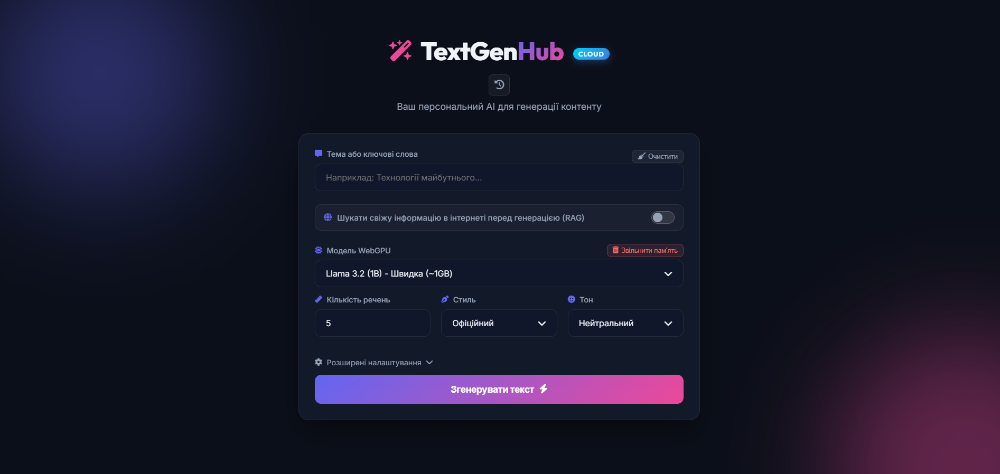

<div align="center">

# TextGenHub (Cloud Version) 🪄

[](https://developer.mozilla.org/en-US/docs/Web/HTML)
[](https://developer.mozilla.org/en-US/docs/Web/CSS)
[](https://developer.mozilla.org/en-US/docs/Web/JavaScript)
[](https://www.python.org/)

*Веб-застосунок для інтелектуальної генерації тексту з використанням вбудованих у браузер моделей штучного інтелекту (WebGPU).*



</div>

## 📖 Про проєкт

**TextGenHub** — це веб-застосунок, який дозволяє згенерувати текст на основі обраної теми, бажаної довжини, стилю та тону. Ця версія адаптована для **хмарного розгортання** (наприклад, на Render, GitHub Pages або Vercel). 

Вона не потребує завантаження жодних сторонніх програм (як-от Ollama) на комп'ютер користувача, оскільки нейромережі завантажуються прямо в кеш браузера і працюють завдяки потужності відеокарти клієнта (WebGPU).

### 🌟 Що нового:
1. **Повна незалежність (WebGPU):** Використовує `@mlc-ai/web-llm` для запуску таких моделей, як Llama 3.1, Llama 3.2, Phi-3 та Gemma 2, прямо у браузері!
2. **RAG (Пошук в інтернеті):** Підтримка Python-бекенду (`server.py`) для пошуку актуальної інформації через DuckDuckGo, що дозволяє ШІ спиратися на свіжі факти.
3. **Модульна архітектура:** Код розбито на дрібні JS-модулі (`api.js`, `llm.js`, `ui.js`, `storage.js`) для легкої підтримки та масштабованості.
4. **Історія генерацій:** Усі згенеровані тексти автоматично зберігаються в LocalStorage.
5. **Очищення кешу:** Кнопка для швидкого видалення гігабайтів завантажених нейромереж з пам'яті браузера.

---

## 🚀 Як запустити локально для тестування

Оскільки проєкт використовує ES6-модулі (`import / export`), його не можна просто відкрити подвійним кліком по `index.html`. Потрібен локальний веб-сервер.

**Крок 1: Встановлення залежностей (тільки для RAG)**
Якщо ви хочете, щоб працював пошук в інтернеті, у вас має бути встановлений Python.
```bash
pip install -r requirements.txt
```

**Крок 2: Запуск сервера**
Просто запустіть файл `start_test.bat` (для Windows) або виконайте команду:
```bash
python server.py
```
Сервер запуститься на `http://localhost:8000`.

**Крок 3: Використання**
Перейдіть у браузері за адресою `http://localhost:8000/app/index.html`. 
При першому використанні обраної моделі, вона буде завантажена в кеш браузера (це може зайняти від 700 МБ до 5 ГБ залежно від моделі). Наступні запуски будуть миттєвими.

---

## 📂 Структура проєкту

- `/app/index.html` — Головна сторінка застосунку.
- `/app/css/` — Стилі, розбиті на компоненти (`base.css`, `layout.css`, `animations.css` тощо).
- `/app/js/` — Модульна логіка:
  - `main.js` — Головний контролер.
  - `llm.js` — Відповідає за ініціалізацію та роботу WebLLM.
  - `api.js` — Робота з RAG та бекендом.
  - `storage.js` — Збереження налаштувань та історії.
  - `config.js` — Словники стилів та тонів.
- `server.py` — Легкий Python-сервер на базі FastAPI для забезпечення RAG та роздачі статики.
- `start_test.bat` — Швидкий скрипт для локального тестування у Windows.
